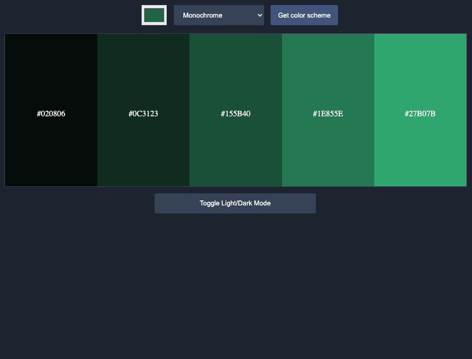

# Color Scheme Generator 🎨

This is a simple and responsive color scheme generator built with HTML, CSS, and JavaScript. It allows users to pick a base color and generate color palettes using different harmony modes like monochrome, analogic, complement, triad, and more, powered by [TheColorAPI](https://www.thecolorapi.com/).

> 💡 This was built as part of a solo project idea from the **Scrimba Frontend Developer Career Path**. Shoutout to [Scrimba](https://scrimba.com) for the learning journey!

## 🚀 Live Demo

👉 Check out the live site here:  
**[color-scheme-generator-nlc.netlify.app(https://color-scheme-generator-nlc.netlify.app/)**  

## 🖼️ Preview

  

## 🛠️ Tech Stack

- **HTML**
- **CSS**
- **Vanilla JavaScript**
- **TheColorAPI** (for color scheme data)

## ✨ Features

- 🎯 Choose a base color with the native color picker
- 🎨 Select from multiple color scheme modes (e.g. Monochrome, Triad, Analogic)
- 📦 Fetches real-time color schemes from TheColorAPI
- 🌗 Toggle between light and dark mode
- 🖱️ Hover interaction to visually inspect each color

## 📦 How to Run Locally

1. Clone the repo:
   ```bash
   git clone https://github.com/your-username/color-scheme-generator.git
